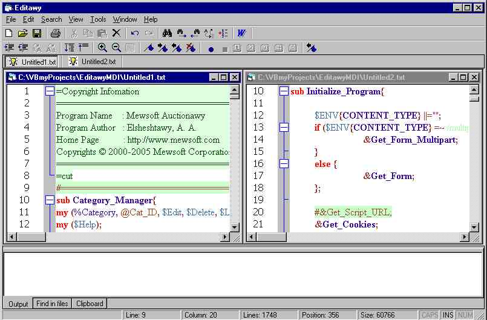



## Source Code Editor Activex Control For All Languages\. Scintilla Activex Wrapper Control

### Description

Source code editor ActiveX Control with syntax hilighter for every programming language, more than 70 until now like PYTHON, CPP, HTML, xml, PERL, SQL, VB, Properties, ERRORLIST, MAKEFILE, BATCH, XCODE, LATEX, LUA, DIFF, CONF, PASCAL, AVE, ADA, LISP, RUBY, EIFFEL, EIFFELKW, TCL, NNCRONTAB, BULLANT, VBSCRIPT, ASP, PHP, BAAN, MATLAB, SCRIPTOL, ASM, CPPNOCASE, FORTRAN, F77, CSS, POV, LOUT, ESCRIPT, PS, NSIS, MMIXAL, CLW, CLWNOCASE, LOT, YAML, TEX, METAPOST, POWERBASIC, FORTH, ERLANG, OCTAVE, MSSQL, VERILOG, KIX, GUI4CLI, SPECMAN, AU3, APDL, BASH, ASN1, VHDL, CAML, BLITZBASIC, PUREBASIC, HASKELL, PHPSCRIPT, TADS3, REBOL, SMALLTALK, FLAGSHIP, CSOUND.

This is scintilla ActiveX Wrapper. To download the full packge with SciLexer.dll and the .ocx, download from our site http://www.mewsoft.com/download/Editawy.zip.

Please check our website for the latest updates, required DLL, and free support.
 
### More Info
 

             |
---                |---
**Submitted On**   |2006-02-20 20:49:42
**By**             |[Ahmed Amin Elsheshtawy](https://github.com/Planet-Source-Code/PSCIndex/blob/master/ByAuthor/ahmed-amin-elsheshtawy.md)
**Level**          |Advanced
**User Rating**    |3.4 (24 globes from 7 users)
**Compatibility**  |VB 3\.0, VB 4\.0 \(16\-bit\), VB 4\.0 \(32\-bit\), VB 5\.0, VB 6\.0, VB Script, ASP \(Active Server Pages\) , VBA MS Access, VBA MS Excel
**Category**       |[Complete Applications](https://github.com/Planet-Source-Code/PSCIndex/blob/master/ByCategory/complete-applications__1-27.md)
**World**          |[Visual Basic](https://github.com/Planet-Source-Code/PSCIndex/blob/master/ByWorld/visual-basic.md)
**Archive File**   |[Source\_Cod199100512006\.zip](https://github.com/Planet-Source-Code/ahmed-amin-elsheshtawy-source-code-editor-activex-control-for-all-languages-scintilla-acti__1-64376/archive/master.zip)

